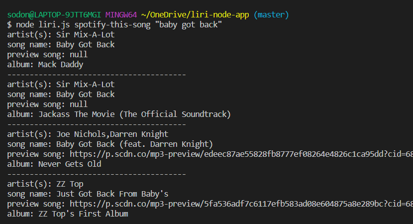
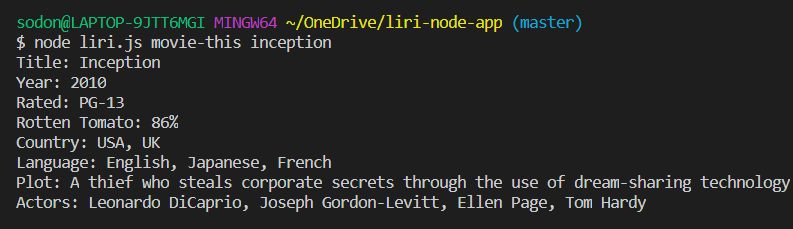
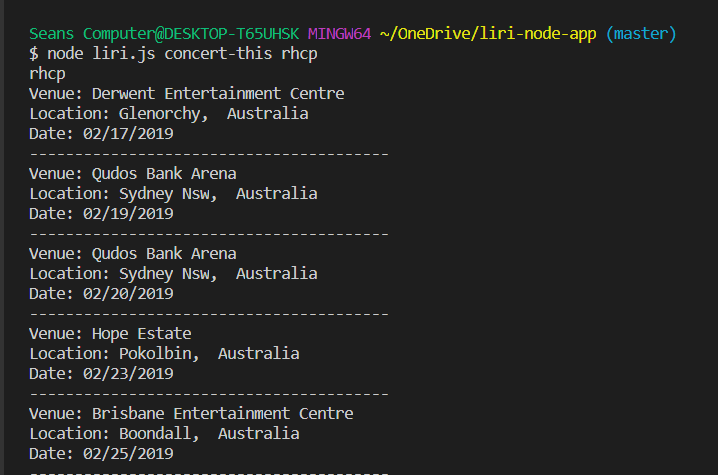
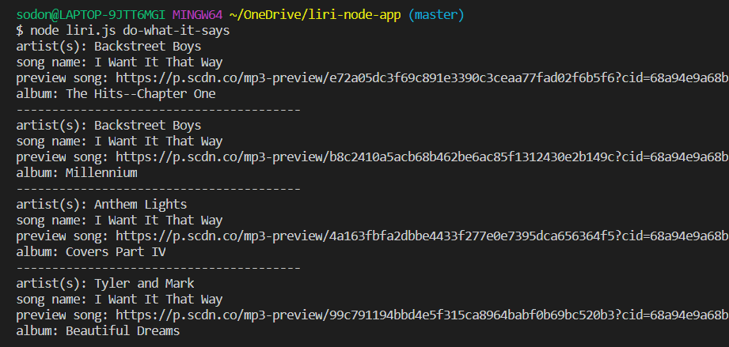

# LIRI - Node App
L.I.R.I. stands for Language Interpretation and Recognition Interface. It is a command line node app that takes in parameters and gives back data from various APIs. 

As the name suggests, LIRI is very similar to iPhone's SIRI, but rather than using speech, LIRI requires written text.

The LIRI app uses Node.js in the command line of your computer and has dependencies for the `request`, `spotify`, and `axios` Node packages. It also uses the built-in `fs` package to read and write to text files.

The app features 4 different features using the `node liri.js [command-here]` syntax. Below are the command types...
  - `spotify-this-song [song-title-here]` returns the artist, song name, album, and preview URL for a specific song using the Spotify API.
  - `movie-this [movie-title-here]` returns the title, year, rating, Rotten Tomatoes rating, country, language, plot summary and actors of a specific movie using the IMDb API.
  - `concert-this [band/artist-title-here]` returns the venue, location, and date of a concert or event pertaining to the searched artist using the Bands In Town API.
  - `do-what-it-says` returns the result of a "random" result by reading the `random.txt` file and performing the command written in that file.

# Instructions
Since this is a command line application, it **must be cloned down to your machine** to be demoed. After cloning down the repo to your computer, `cd` into the `liri-node-app` folder and run `npm install` to download all the node dependencies mentioned above. You will also have to set up your own API Keys in the .env file to access Spotify.

# Screenshots

## Spotify API
Running the command `node liri.js spotify-this-song "Baby Got Back"` will return the track info from Spotify.
  

## IMDb API
Running the command `node liri.js movie-this Inception` will return the movie info from IMDb.
  
   

## Bands In Town API
Running the command `node liri.js concert-this RHCP` will return the event info from Bands In Town.
  
   
 

## Node `fs` file reader
Running the command `node liri.js do-what-it-says` will read a command out of the `random.txt` file and perform it.
  

# Technologies Used
- Javascript
- Node.js
- Axios
- NPM
- Moment

## Author
- Sean ODonnell

  

